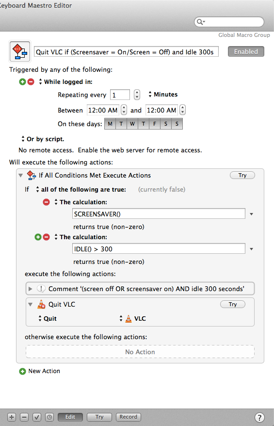

# Km-Quit-VLC-on-Idle #

[Ask Different user asked](http://apple.stackexchange.com/questions/118915/is-there-a-way-to-shutdown-mac-when-screen-is-turned-off):

> I have a mac mini, which is connected to a TV using HDMI cable. TV & mini are connected to separate power source, so that I can shutdown TV and mini independently as required.

> Primary use of mini is a media center and i watch lot of online videos over it.

> The problem is sometime, if i switch off the TV, online videos continue to play in the computer and thus consuming bandwidth. So i'm looking for a way to shutdown (close my video player application etc.) mini if the TV display goes off.

I don’t know which app(s) the original poster is using, so I chose [VLC][], but this macro could be used to quit any application (or applications).

While [Keyboard Maestro][] cannot trigger on screensaver or “screen off” it does have a conditional `SCREENSAVER()` which will return true if either of these conditions are true:

1.	The screensaver of the Mac is turned ON

2.	The screen of the Mac is turned OFF

However, you might not want to trigger *only* on those conditions, because what if you just happen to step away for a few minutes? So I decided to add a check to see if the computer has been idle for at least 5 minutes using `IDLE() > 300`  (change “300” to however many seconds you want to make sure the computer has been idle for before the macro will match).

Then we just have to tell Keyboard Maestro how often to have this macro run. I decided to have it run every minute from midnight-to-midnight, but you could adjust the hours, for example, if you only wanted to run this in the evening when you might have been watching TV on your Mac. Keyboard Maestro is very efficient and I’m guessing that I would never notice that this ran once a minute all day long, so it’s not something you need to worry about it interfering with the regular use of your Mac.

Here’s what the macro looks like in Keyboard Maestro:

To use this macro, [download the file](KM-Quit-VLC-idle-screensaver.kmmacros) and then double-click it to install in Keyboard Maestro.

If you want to change the app which will be quit, just click ‘VLC’ and choose a different app. 

If you want to add more actions to be taken with this macro, click ‘New Action’ and add another one either before or after ‘Quit VLC’.

[Keyboard Maestro]: http://www.keyboardmaestro.com/main/
[VLC]: http://www.videolan.org/vlc/index.html